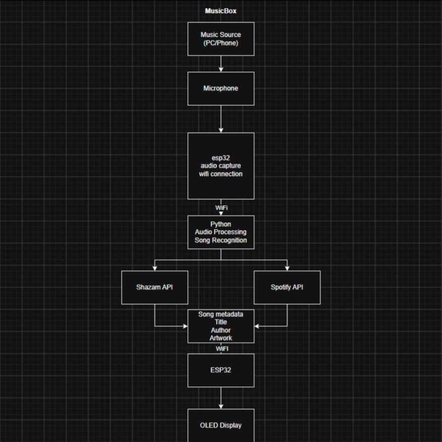

# Musicbox

A personal hardware + software project built around an ESP32, Python, music recognition, and Spotify integration.
Musicbox is designed to identify and display music in a dedicated physical device. The project combines custom hardware with a Python backend to create a small, standalone music companion.

## Concept

Musicbox will be able to:

* Recognize music using **Shazam**
* Connect to a user's **Spotify account**
* Display the currently playing or recognized song
* Communicate between Python and an **ESP32**
* Display song information on an **OLED / LED display**
* Eventually provide a custom physical interface and enclosure

The long-term goal is to build the entire system from scratch, including the software, electronics, and physical design.

## Project Diagram


## Planned Features

### Music Recognition

Use a microphone and Shazam-based recognition to identify music playing around the device.

### Spotify Integration

Authenticate with Spotify and retrieve information about the user's currently playing track.

### ESP32 Communication

Use an ESP32 as the main hardware controller and communicate with the Python backend over Wi-Fi.

### Display

Display information such as:

* Song title
* Artist
* Album
* Album artwork
* Playback information

### Physical Design

Eventually design and 3D-print a custom enclosure for the Musicbox.

## Technology

**Software**

* Python
* Spotify Web API
* Shazam music recognition
* REST / network communication

**Hardware**

* ESP32
* Microphone
* OLED / LED display
* Speaker
* Custom 3D-printed enclosure
* Beam Splitter cube (Lyrics module, not confirmed)

## Project Status

**Early development — initial architecture**

I am starting to work on this project and will try to get all the code done relatively fast, because i have previous experience with coding but have no experience with
hardware.

## Goals

The main goal is not simply to assemble existing components, but to understand and build the different parts of the system myself — from the Python backend and APIs to the ESP32 firmware, electronics, and physical enclosure.

### Installation (mainly for me):
```
py -3.12 -m venv .venv
.\.venv\Scripts\Activate.ps1
pip install -r requirements.txt
```

## -373
